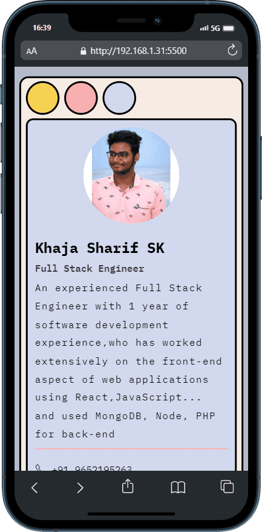

# Resume

<!--
This Resume is built with `HTML` , `CSS` -->

## Table of Contents

- [Project Title](#project-title)
- [Description](#description)
- [Demo](#demo)
- [Internship](#internship)
- [Technologies Used](#technologies-used)
- [Features](#features)
  <!-- - [Installation](#installation) -->
  <!-- - [Usage](#usage) -->
  <!-- - [Contributing](#contributing) -->
- [License](#license)
<!-- - [Acknowledgments](#acknowledgments) -->

## Description

This Resume using HTML for structure and CSS for styling, you can create a professional and personalized digital resume that is easily accessible on the web. This approach allows you to design a modern and responsive resume that stands out and makes a strong impression on recruiters and hiring managers.

## Demo

<!-- [Include links to a live demo, screenshots, or GIFs that showcase your project in action.] -->

click above image to view the [live preview](https://sharif-22.github.io/web-resume-1/)

## Internship

This internship is provided by [CyberDude Networks Pvt. Ltd.](https://youtube.com/cyberdudenetworks) as part of the 6-Month Free Internship program, a skill development initiative organized to enhance participants' skills. Mentoring was provided by [Mr. Anbuselvan Rocky](https://instagram.com/anbuselvanrocky). For more information, [you can contact CyberDude Networks here](https://cyberdudenetworks.com).

## Technologies Used

<!-- [List the technologies, programming languages, and libraries/frameworks used in your project.] -->
<ol>
    <li>HTML</l1>
    <li>CSS</l1>
</ol>

## Features

<!-- - [List the key features and functionality of your project.] -->

we used `BEM methodology` for class naming and for ensuring a well-structured and maintainable codebase.

<!-- ## Installation

[Provide step-by-step instructions on how to install and set up your project locally. Include any prerequisites and dependencies.]

## Usage

[Explain how to use your project, including any configuration options, examples, or code snippets.]

## Contributing

[Explain how others can contribute to your project, such as reporting issues, submitting pull requests, and any coding guidelines.] -->

## License

<!-- [Specify the license under which your project is distributed. For example, you can use an open-source license like MIT, GPL, or Apache 2.0. Include a link to the full license text.] -->

[⚖ MIT](./LICENCE.md)

## Acknowledgments

 

          Design inspried from
          <a
            target="_blank"
            href="https://www.canva.com/templates/EAFI1968SX0-blue-retro-graphic-designer-resume/"
            >Canva</a
          >
          Designed by
          <a target="_blank" href="https://dribbble.com/kawalanstudio"
            >kawalan studio</a
          >

